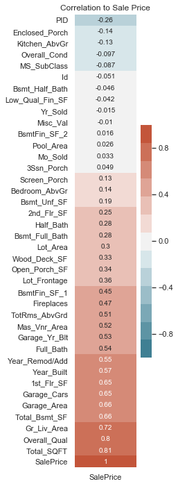
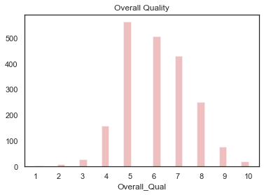
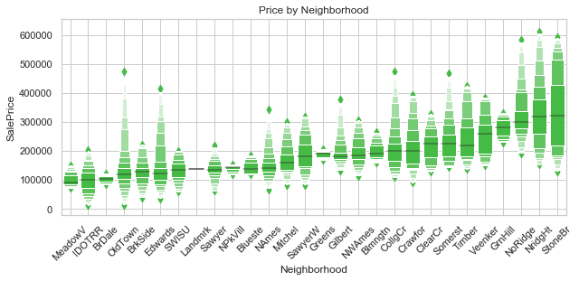
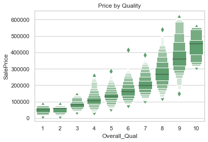
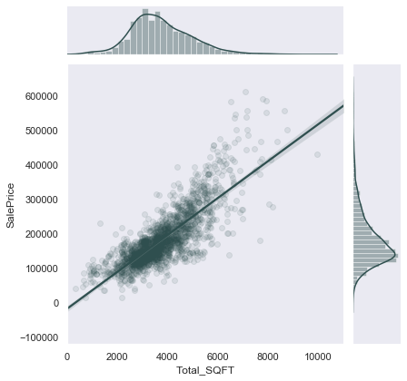
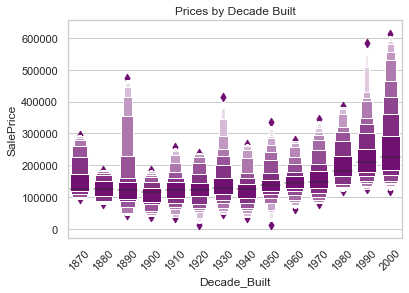
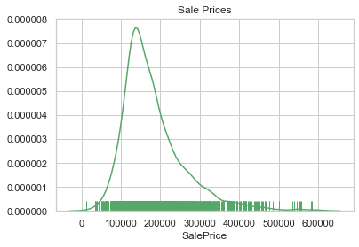
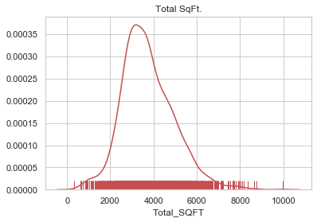
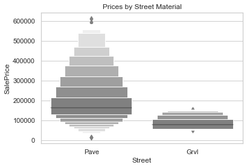

# EDA Plots

## J



## Overa



## a



## z



## w


```
Reference:___________________________________________________________________
|                                                                           |
|   20..............1-STORY 1946 & NEWER ALL STYLES                         |
|   30..............1-STORY 1945 & OLDER                                    |
|   40..............1-STORY W/FINISHED ATTIC ALL AGES                       |
|   45..............1-1/2 STORY - UNFINISHED ALL AGES                       |
|   50..............1-1/2 STORY FINISHED ALL AGES                           |
|   60..............2-STORY 1946 & NEWER                                    |
|   70..............2-STORY 1945 & OLDER                                    |
|   75..............2-1/2 STORY ALL AGES                                    |
|   80..............SPLIT OR MULTI-LEVEL                                    |
|   85..............SPLIT FOYER                                             |
|   90..............DUPLEX - ALL STYLES AND AGES                            |
|   120.............1-STORY PUD (Planned Unit Development) - 1946 & NEWER   |
|   150.............1-1/2 STORY PUD - ALL AGES                              |
|   160.............2-STORY PUD - 1946 & NEWER                              |
|   180.............PUD - MULTILEVEL - INCL SPLIT LEV/FOYER                 |
|   190.............2 FAMILY CONVERSION - ALL STYLES AND AGES               |
|___________________________________________________________________________|
```

## Sale Price by Total Sqft.



## er



## DD



## de



## as


